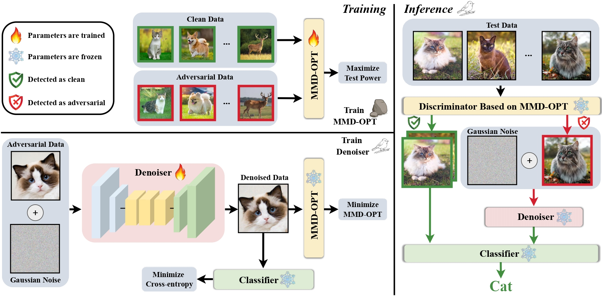

# Code implementations for ICLR 2025 submission
## Distributional Discrepancy Minimization Can Help Adversarial Classification

 #### Abstract
 Statistical adversarial data detection (SADD) identifies whether an upcoming batch contains adversarial examples (AEs). Given the distributional discrepancies between natural examples (NEs) and AEs, SADD offers statistical guarantees against adversarial attacks. However, an undeniable problem of SADD-based methods is that they discard entire data batches that contain AEs, leading to poor model deployment during testing time. In this paper, to solve this problem, we propose a new statistical adversarial defence method, named Distributional-Discrepancy-based Adversarial Defense (DAD). In the training phase, DAD first optimizes the test power of the maximum mean discrepancy (MMD) to derive MMD-OPT and then trains a denoiser by minimizing the MMD-OPT between NEs and AEs. In the testing phase, DAD uses MMD-OPT to detect AEs and then denoises them instead of discarding them. Theoretically, we justify that narrowing the distributional discrepancy can help reduce the upper bound of risk on AEs. Empirically, DAD will not discard data compared to detection-based defense methods and outperforms current state-of-the-art adversarial training (AT) and adversarial purification (AP) methods by notably improving natural and robust accuracy simultaneously on CIFAR-10 and ImageNet-1K against various adversarial attacks, including adaptive attacks, which pioneers a new road for statistical adversarial defense methods.

#### Figure 1: The illustration of our method.


### Environment Setup
Please make sure to set up the environment within the cloned repository directiory.
```
conda create -n [your_env_name] python=3.9

conda activate [your_env_name]

conda install pip

pip install -r requirements.txt
```

### AutoAttack Implementation and Evaluation
The implementation and evaluation of AutoAttack used in our paper strictly follows [RobustBench](https://robustbench.github.io/) with the following [GitHub link](https://github.com/RobustBench/robustbench).

To use AutoAttack, please clone the following repository into our repository:

```
git clone https://github.com/fra31/auto-attack.git
```

### BPDA+EOT Implementation and Evaluation
The implementation and evluation of BPDA+EOT strictly follows [the paper](https://arxiv.org/abs/2005.13525) with the following [GitHub link](https://github.com/point0bar1/ebm-defense).

### Pre-trained Classifiers
The checkpoint of pre-trained classifiers on CIFAR-10 should be put in 
```checkpoint/CIFAR10/[your model name]```. For example, the checkpoint of pre-trained ```WideResNet-28-10``` on CIFAR-10 should be put in ```checkpoint/CIFAR10/WRN28```.
- The training recipe of ```ResNet``` and ```WideResNet``` on CIFAR-10 follows the [GitHub link](https://github.com/meliketoy/wide-resnet.pytorch). 

- To train ```ResNet``` and ```WideResNet```:
```
git clone https://github.com/meliketoy/wide-resnet.pytorch.git

# train a WRN-28-10
python3 main.py --lr 0.1 --net_type 'wide-resnet' --depth 28 --widen_factor 10 --dataset 'cifar10'

# train a WRN-70-16
python3 main.py --lr 0.1 --net_type 'wide-resnet' --depth 70 --widen_factor 16 --dataset 'cifar10'

# train a RN-18
python3 main.py --lr 0.1 --net_type 'resnet' --depth 18 --dataset 'cifar10'

# train a RN-50
python3 main.py --lr 0.1 --net_type 'resnet' --depth 50 --dataset 'cifar10'
```
- The training recipe of ```Swin-Transformer``` on CIFAR-10 follows the [GitHub link](https://github.com/kentaroy47/vision-transformers-cifar10).

- To train a Swin-Transformer: 
```
git clone https://github.com/kentaroy47/vision-transformers-cifar10.git

python train_cifar10.py --net swin --n_epochs 400
```

- The pre-trained ```ResNet-50``` on ImageNet-1K follows [the Pytorch implmentation](https://pytorch.org/vision/main/models/generated/torchvision.models.resnet50.html) with ```ResNet50_Weights.IMAGENET1K_V2```.

### Run Experiments
#### Train DAD on CIFAR-10
- Generate training data for MMD and denoiser:
```
cd dataset

python3 cifar10.py
```
- Train DAD:
```
# train DAD on WRN-28-10
python3 train.py --data 'CIFAR10' --model 'wrn28' --batch-size 500 --epochs 60 

# train DAD on RN-18
python3 train.py --data 'CIFAR10' --model 'rn18' --batch-size 500 --epochs 60 
```

#### Evaluate DAD on CIFAR-10
```
# evaluate DAD on WRN-28-10
python3 test.py --data 'CIFAR10' --model 'wrn28' --batch-size 100

# evaluate DAD on RN-18
python3 test.py --data 'CIFAR10' --model 'rn18' --batch-size 100
```

#### Train DAD on ImageNet-1K
- Generate training data for MMD and denoiser:
```
cd dataset

python3 imagenet.py
```
- Generate adversarial data for training MMD and denoiser:

```
python3 adv_generator.py  --mode 'train' --data 'ImageNet' --model 'rn50' --attack 'pgd' --epsilon 8/255
```
- Train DAD:
```
python3 train.py --data 'ImageNet' --model 'rn50' --batch-size 128 --epochs 60 
```

#### Evaluate DAD on ImageNet-1K
```
python3 test.py --data 'ImageNet' --model 'rn50' --batch-size 100
```

#### Evaluate DAD against whitebox/adaptive attacks
```
python3 whitebox_attack.py

python3 adaptive_detector_attack.py

python3 adaptive_denoiser_attack.py
```

#### Evaluate DAD against transfer attacks
- Generate transfer attacks:
```
# Take RN18 as an example

python3 adv_generator.py  --mode 'test' --data 'CIFAR10' --model 'rn18' --attack 'mma' --epsilon 8/255

python3 adv_generator.py  --mode 'test' --data 'CIFAR10' --model 'rn18' --attack 'eotpgd' --epsilon 8/255

python3 adv_generator.py  --mode 'test' --data 'CIFAR10' --model 'rn18' --attack 'cw' --num-step 200 --epsilon 0.5

python3 adv_generator.py  --mode 'test' --data 'CIFAR10' --model 'rn18' --attack 'mma' --epsilon 12/255

python3 adv_generator.py  --mode 'test' --data 'CIFAR10' --model 'rn18' --attack 'eotpgd' --epsilon 12/255

python3 -adv_generator.py  --mode 'test' --data 'CIFAR10' --model 'rn18' --attack 'cw' --num-step 200 --epsilon 1.0
```

- Evaluate the performance against transfer attacks:
```
# Take RN18 as an example

python3 transfer_attack.py --model 'rn18' --epsilon 8/255

python3 transfer_attack.py --model 'rn18' --epsilon 12/255
```

### License and Contributing
- This README is formatted based on [the NeurIPS guideline](https://github.com/paperswithcode/releasing-research-code).
- Feel free to post any issues via Github.


